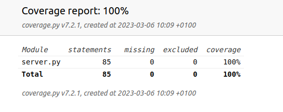
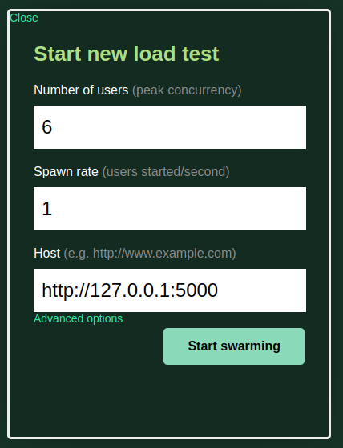
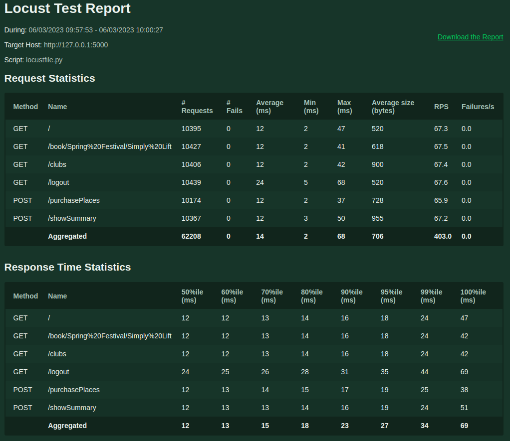

# gudlift-registration

Projet 11 de la formation Openclassrooms Développeur d'application Python.

## Description 

Ce projet est un POC qui est une version légère permettant de réserver des places pour des compétitions via la plateforme. Le but du projet est de proposer une application aussi légère que possible. De plus l'application doit être entièrement débuggée, testée et performante. 

## Technologies

Ce projet utilise les technologies suivantes :

- Python v3.x+
- [Flask](https://flask.palletsprojects.com/en/1.1.x/)
- [Virtual environment](https://virtualenv.pypa.io/en/stable/installation.html)

## Procédure d'installation

### Import du dépôt Github
Dans un dossier de travail, importez le dépôt github puis, changez de répertoire courant pour vous positionner dans le répertoire cloné. 
```sh
$ git clone https://github.com/lcourdes/Python_Testing.git
$ cd Python_Testing
```

### Création d'un environnement virtuel
Il est recommandé d'installer un environnement virtuel. Pour ce faire, suivez les instructions 
ci-dessous :

- S'il ne l'est pas déjà, installez le package *virtualenv* :
```sh
$ pip install virtualenv
```

- Créez un environnement de travail et activez-le :
```sh
$ python3 -m venv env
$ source env/bin/activate
```

### Installation des librairies
Installez les librairies nécessaires au bon fonctionnement du programme à l'aide du fichier requirements.txt :
```sh
$ pip install -r requirements.txt
```

## Lancement du serveur
Pour démarrer le programme, exécutez les commandes suivantes : 
```sh
$ export FLASK_APP=server.py
$ flask run
```

Par défault le port utilisé est le suivant : http://127.0.0.1:5000

## Les tests 

### Pytest 
Pytest doit être utilisé pour exécuter les tests unitaires et fonctionnels (utilisation de Selenium) : 
```sh
$ pytest -v
```

### Couverture de tests
Pour vérifier la couverture de tests exécutez la commande suivante utilisant la bibliothèque coverage : 
```sh
$ pytest --cov=server
```

Afin de générer un rapport html vous exécutez la commande suivante : 
```sh
$ pytest --cov=server --cov-report html
```



### Tests de performance
Afin de vérifier la performance des routes, il est possible d'utiliser la bibliothèque locust : 
```sh
$ cd tests/performance_tests
$ locust
```

L'application doit être lancée dans un second terminal pour vérifier la performance. 

Locust ouvre une page sur un navigateur qui peut être renseignée de la manière suivante permettant alors de vérifier la performance.





## Lien Github

[](https://github.com/lcourdes/https://github.com/lcourdes/Python_Testing)